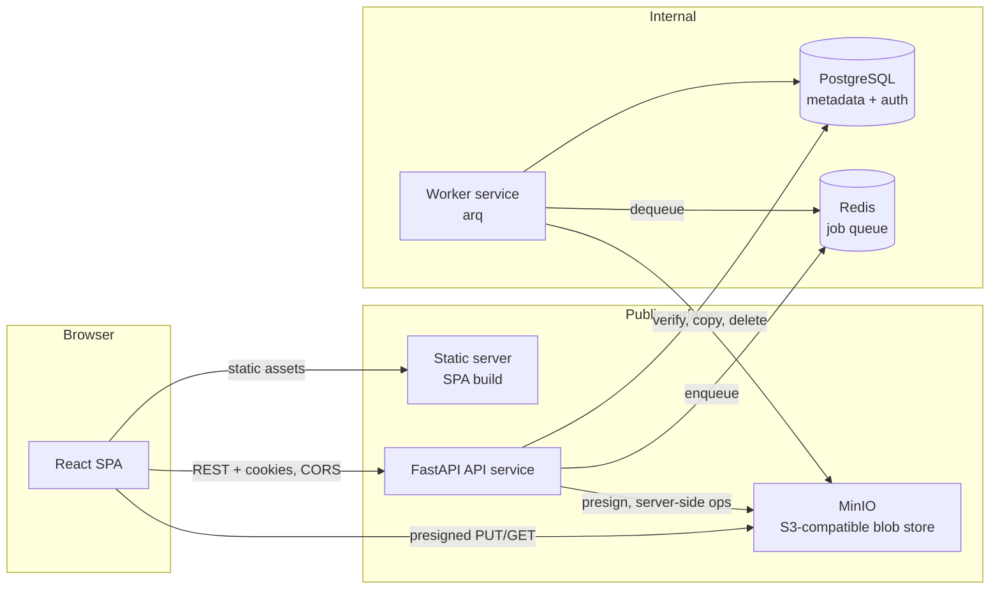
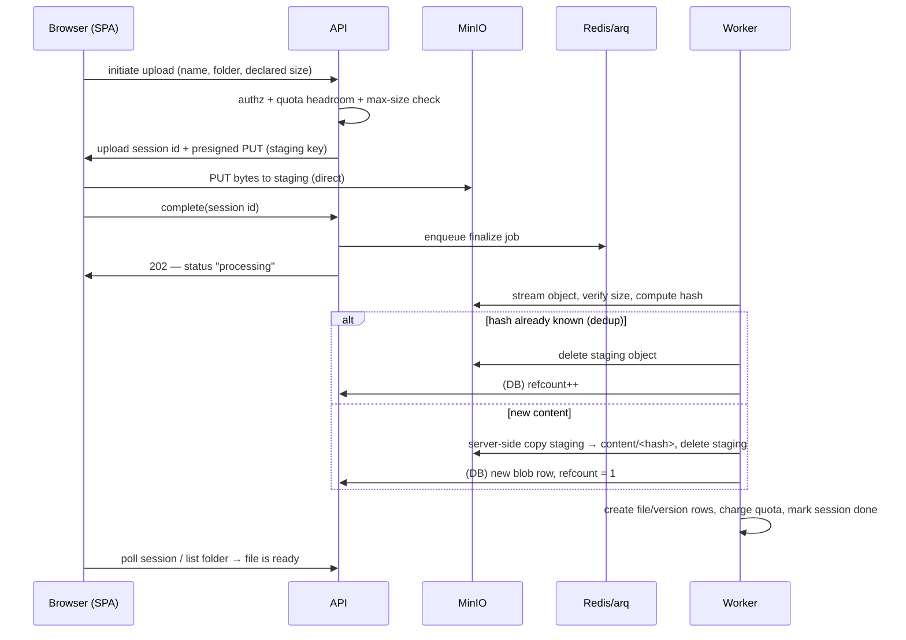

# Architecture — Distributed Storage

| | |
|---|---|
| Status | Approved |
| Version | 1.0 |
| PRD | [docs/PRD.md](PRD.md) v1.0 |
| Decisions | [docs/adr/](adr/) — every significant choice below has an ADR |
| Last updated | 2026-07-19 |

This document describes the system at the component-and-flow level. It names the technologies that
were **decided** (see ADRs) but stays out of code-level design — data models, API shapes, and edge
cases live in per-feature design docs under `docs/design/`.

## 1. System overview

Six runtime components. Three are publicly reachable (browser-facing), three are internal.

| Component | Role | Decided by |
|---|---|---|
| **API service** | The existing FastAPI modular monolith, extended with storage, sharing, quota, and trash modules. Owns all authorization and all metadata writes. | existing platform |
| **React SPA** | TypeScript + Vite single-page app; the product's web UI. Served as a static build from its own origin. | [ADR-0009](adr/0009-react-spa-frontend.md) |
| **Worker service** | Separate container running the same Python codebase; executes queued jobs (upload finalization) and periodic jobs (trash purge, version pruning, staging cleanup, orphan-blob GC). | [ADR-0007](adr/0007-dedicated-worker-arq-redis.md) |
| **PostgreSQL** | Single source of truth: accounts/auth (existing) plus folder hierarchy, files, versions, shares, links, trash state, quotas, blob reference counts, upload sessions. | [ADR-0002](adr/0002-metadata-in-postgresql.md) |
| **MinIO** | S3-compatible object store holding file bytes only. Two buckets: `staging` (in-flight uploads) and `content` (finalized, content-addressed blobs). | [ADR-0003](adr/0003-blob-store-minio-s3.md) |
| **Redis** | Backing store for the arq job queue. Queue only — not a cache, not a session store; treated as losable (see §6). | [ADR-0007](adr/0007-dedicated-worker-arq-redis.md) |

## 2. Storage model

Decided across [ADR-0004](adr/0004-content-addressed-blob-layout.md),
[ADR-0005](adr/0005-whole-file-blobs.md), [ADR-0006](adr/0006-refcounted-dedup.md):

- **Whole-file blobs.** Every file version is exactly one object. No chunking in v1; content
  addressing keeps the door open for it when sync arrives.
- **Content-addressed.** Finalized objects are stored under their content hash
  (`content/<hash>`). The user-visible hierarchy (names, folders, paths) exists **only** in
  PostgreSQL; renames and moves never touch MinIO.
- **Deduplicated with reference counts.** Identical content is stored once. Each blob row in
  PostgreSQL carries a refcount incremented by every version that points at it (across all users)
  and decremented when a version is pruned or purged. Only the worker deletes objects from
  `content/`, and only at refcount zero.
- **Quota is logical, not physical.** A user is charged the full size of every version and trashed
  item they own, regardless of dedup savings. Dedup is an operator benefit, invisible to users —
  anything else makes quota unpredictable and gameable.

## 3. Core flows

### 3.1 Upload (two-phase, asynchronous finalize)

Presigned direct upload ([ADR-0008](adr/0008-presigned-url-data-path.md)) means the API never sees
the bytes, so hashing/dedup happen after the fact, in the worker
([ADR-0010](adr/0010-async-upload-finalization.md)):

Failure behavior: oversized or corrupt uploads fail the session with a stated reason and the
staging object is removed; abandoned sessions (browser gone before `complete`) are swept by a
periodic staging-cleanup job. A file is never visible in a folder listing until finalize commits —
there are no half-uploaded files, only a visible "processing" entry tied to the upload session.

### 3.2 Download

API authorizes (owner, user-to-user share, or public-link token), then issues a short-lived
presigned GET with the correct download filename; the browser fetches bytes directly from MinIO.
Public-link downloads follow the identical path — the link token is the authorization.

### 3.3 Overwrite → version

An overwrite is the same upload flow targeting an existing file. Finalize creates a new version
row pointing at the (possibly shared) blob and prunes beyond the retention limit (N=5): the oldest
version row is deleted, its blob refcount decremented, and a zero refcount enqueues blob deletion.

### 3.4 Trash lifecycle

Delete is a metadata state change — blobs and refcounts are untouched, shares are suspended, quota
still charged. Restore reverses it. The purge job permanently removes items past retention
(30 days) or on explicit "empty trash": version rows deleted, refcounts decremented, zero-ref
blobs cleaned from MinIO. Bytes leave disk **only** through the purge path.

### 3.5 Sharing and search

Pure PostgreSQL features — no blob involvement. Shares and links are metadata resolved during
authorization; search is a filename query scoped to what the user owns plus what's shared with
them.

## 4. Web client and authentication

- **Separate origins** ([ADR-0011](adr/0011-separate-origins-cors.md)): SPA, API, and MinIO are
  each exposed on their own origin. The browser crosses origins with CORS; the API's existing
  strict-allowlist CORS applies, and MinIO needs a CORS policy for presigned PUT/GET from the SPA
  origin.
- **httpOnly cookie sessions** ([ADR-0012](adr/0012-httponly-cookie-session.md)): the SPA never
  touches tokens. The API sets access/refresh material in httpOnly cookies; the existing
  refresh-rotation and revocation semantics are preserved behind the cookie surface.
- **Consequences to respect** (detailed in the auth design doc): cross-origin cookies require
  `SameSite=None; Secure` — so any non-localhost deployment requires HTTPS on all three origins —
  credentialed CORS with exact origins (never `*`), and explicit CSRF protection on
  state-changing endpoints, since cookies attach automatically.

## 5. Mapping onto the existing monolith

The API stays one deployable, extended module-by-module under the existing layering
(routes → services → repositories → models):

| New module | Owns |
|---|---|
| `storage` | folders, files, versions, trash, upload sessions, blob refcounts |
| `sharing` | user-to-user shares, public links, share-aware authorization helpers |
| `quota` | limits, usage accounting, admin settings |
| `worker` (entrypoint) | arq worker startup + job definitions, importing the same services |

Auth/users modules are reused as-is (plus the cookie-session change). The worker is the same
codebase in a second container — not a separate service in the microservice sense. Future
extraction candidates ordered by cleanliness of the seam: sharing, then storage+worker as a unit.

## 6. Consistency and failure model

- **PostgreSQL is the source of truth.** A MinIO object no DB row points at is garbage (collected
  by the orphan-GC job after a safety window); a DB row whose blob is missing is corruption and is
  surfaced loudly, never silently healed.
- **The finalize window is the only eventual consistency** users can observe ("processing"). All
  other operations are transactional metadata changes with read-your-writes behavior.
- **Jobs are idempotent and the queue is losable.** Every queued action is safe to run twice, and
  every queued action has a periodic sweep that would eventually do the same work (e.g. a lost
  finalize job is caught by the staging sweep failing the session). Losing Redis loses no data —
  only promptness.
- **Backup = PostgreSQL dump + MinIO `content/` bucket.** Staging and Redis are explicitly not
  backup-worthy. Restore order: database, then blobs; the orphan-GC safety window tolerates the
  buckets being "ahead" of the database.

## 7. Deployment (v1)

Docker Compose, one host: `web` (static SPA), `api`, `worker`, `postgres`, `redis`, `minio`.
Browser-reachable: `web`, `api`, `minio` (its S3 port only, for presigned requests). Internal:
`postgres`, `redis`, MinIO console. Existing conventions carry over: migrations gate API startup,
healthchecks everywhere, non-root containers, secrets via environment with production-safety
validation. Production caveat from §4: all three public origins need TLS.

## 8. Risks accepted (summary — details in the ADRs)

| Risk | Accepted because / mitigated by |
|---|---|
| MinIO exposed to browsers | Presigned-only access, short expiries, bucket policies deny anonymous ops |
| "Processing" UX on every upload | Honest at any file size; SPA polls session status; worker keeps latency small at v1 scale |
| Redis = one more stateful service | Queue-only role, losable by design (§6) |
| Cross-origin cookies complexity | Standard, well-understood mitigations (HTTPS, SameSite=None, CSRF header) captured as hard requirements in the auth design doc |
| Refcount discipline bugs → data loss | Only the worker deletes content; GC has a safety window; refcount transitions covered by tests before any deletion code ships |
