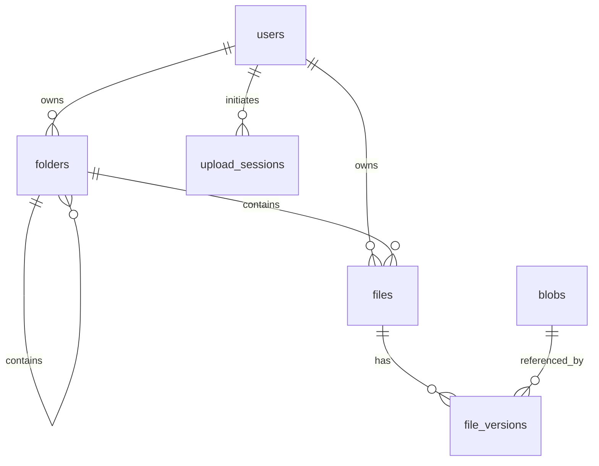

# Design: Storage data model

| | |
|---|---|
| Status | Approved |
| Feature | Foundation for all storage features (PRD §5.1–5.6) |
| ADRs | [0002 metadata in PostgreSQL](../adr/0002-metadata-in-postgresql.md), [0004 content addressing](../adr/0004-content-addressed-blob-layout.md), [0005 whole-file blobs](../adr/0005-whole-file-blobs.md), [0006 refcounted dedup](../adr/0006-refcounted-dedup.md) |
| Last updated | 2026-07-19 |

Defines the PostgreSQL schema for folders, files, versions, blobs, trash, quota, and upload
sessions. Shares and public links get their shape in `design/sharing.md`; this doc only fixes
what they will point at.

## 1. Decisions this doc is built on

| Decision | Choice (owner) | Rejected alternatives |
|---|---|---|
| Hierarchy representation | **Materialized path** (`ltree` on folders) | Adjacency-only (recommended for one-row moves; rejected for slower subtree reads); closure table (heaviest machinery) |
| Node model | **Separate `folders` and `files` tables** | Single `items` table (recommended for uniform share/trash/search targets; rejected in favor of strict DB typing) |
| Trash | **In-place flag** on the trashed top item; descendants implicitly trashed | Hidden trash-root folder (physical moves, loses original location) |
| Quota accounting | **Stored `used_bytes` counter** + periodic reconciliation | Compute-on-demand aggregates |

Consequences accepted with A2+B2 (recorded so nobody is surprised later): folder moves rewrite
descendant folder paths; `parent_id`↔`path` must be kept consistent by the service layer; shares
need a polymorphic reference (two nullable FKs + CHECK); listings and search combine two tables;
sibling-name uniqueness across the two tables is a service-layer rule.

**The redeeming interaction:** only folders form the tree, so `path` exists **only on
`folders`**. Files attach via `folder_id` and follow their folder implicitly — a folder move
rewrites descendant *folder* rows only, never the files inside them.

## 2. Entity overview



## 3. Tables

Types shown informally; real DDL comes from SQLAlchemy models + Alembic. All PKs are UUIDs, all
timestamps UTC (`TIMESTAMPTZ`), naming conventions per `models/base.py`.

### 3.1 `folders`

| Column | Type | Notes |
|---|---|---|
| `id` | UUID PK | |
| `owner_id` | UUID FK → users | |
| `parent_id` | UUID FK → folders, nullable | NULL only for the per-user root row |
| `path` | LTREE, not null | id-derived labels (UUID hex, dashes stripped); root = own label |
| `name` | TEXT | root row: empty string, never displayed |
| `trashed_at` | TIMESTAMPTZ nullable | set only on the *top* trashed item |
| `original_parent_id` | UUID nullable | remembered for restore |
| `created_at` / `updated_at` | | |

Indexes/constraints: GiST on `path`; btree on `(parent_id)`; unique `(parent_id, lower(name))`
among sibling folders; exactly one root per user (`unique (owner_id) WHERE parent_id IS NULL`).

**Root provisioning:** every user gets a root folder row, created idempotently on first storage
access (and backfilled by migration for existing users). The root cannot be renamed, moved,
trashed, or shared.

### 3.2 `files`

| Column | Type | Notes |
|---|---|---|
| `id` | UUID PK | |
| `owner_id` | UUID FK → users | denormalized from folder for direct scoping |
| `folder_id` | UUID FK → folders, not null | |
| `name` | TEXT | |
| `current_version_id` | UUID FK → file_versions, nullable | NULL only while first upload is processing |
| `trashed_at` | TIMESTAMPTZ nullable | direct file trash |
| `original_folder_id` | UUID nullable | for restore |
| `created_at` / `updated_at` | | |

Indexes/constraints: btree `(folder_id)`; unique `(folder_id, lower(name))` among sibling files;
btree `(owner_id, lower(name))` supporting search.

**Sibling-name rule:** a name must be unique among *all* siblings — folders and files together.
Per-table unique indexes cover half each; the cross-table half is enforced in the storage service
(check the other table inside the same transaction). This is a known B2 tax, accepted.

### 3.3 `file_versions`

| Column | Type | Notes |
|---|---|---|
| `id` | UUID PK | |
| `file_id` | UUID FK → files (CASCADE) | |
| `blob_hash` | TEXT FK → blobs | |
| `size_bytes` | BIGINT | |
| `uploaded_by` | UUID FK → users | owner or an editor (sharing) |
| `created_at` | | |

Ordered by `created_at`; the current one is `files.current_version_id`. Retention: max **5** per
file (service-wide setting) — on exceeding, the oldest row is deleted and its blob dereferenced.
Restore-old-version inserts a *new* version row pointing at the old blob (refcount +1).

### 3.4 `blobs`

| Column | Type | Notes |
|---|---|---|
| `hash` | TEXT PK | SHA-256 hex; the object key is `content/<hash>` |
| `size_bytes` | BIGINT | |
| `refcount` | INT ≥ 0 | number of `file_versions` rows referencing it, across all users |
| `created_at` | | |

Refcount invariants (the data-loss-critical rules, per ADR-0006):
- +1 exactly when a version row is inserted; −1 exactly when one is deleted — always in the same
  transaction.
- Object deletion in MinIO happens only via the worker's GC job, only for `refcount = 0` rows
  older than the safety window, deleting the DB row and object together.
- The reconciliation job recomputes refcounts from `file_versions` and repairs drift (alerting,
  not silently, if repairs were needed).

### 3.5 `upload_sessions`

| Column | Type | Notes |
|---|---|---|
| `id` | UUID PK | doubles as the staging object key `staging/<id>` |
| `owner_id` | UUID FK → users | |
| `target_folder_id` | UUID FK → folders | |
| `target_file_id` | UUID FK → files, nullable | set when the upload is an overwrite |
| `declared_name` | TEXT | |
| `declared_size` | BIGINT | quota headroom was checked against this |
| `status` | ENUM `pending / uploaded / processing / done / failed` | |
| `failure_reason` | TEXT nullable | |
| `created_at` / `updated_at` | | |

Swept by the worker: `pending`/`uploaded` sessions older than the staleness window are failed and
their staging objects deleted.

### 3.6 `users` (additions to the existing table)

| Column | Type | Notes |
|---|---|---|
| `quota_bytes` | BIGINT nullable | NULL = service-wide default applies |
| `used_bytes` | BIGINT default 0 | sum of `size_bytes` over all the user's versions (trash included) |

`used_bytes` transitions in the same transaction as every version insert/delete. Quota check at
upload initiation: `used_bytes + declared_size ≤ effective quota` (re-verified at finalize with
the actual size).

## 4. Key operations (with the A2+B2 mechanics)

**List a folder** — two indexed queries merged in the service (folders by `parent_id`, files by
`folder_id`), folders first, name order.

**Subtree of a folder** (folder download, share scope, size display):
```sql
SELECT * FROM folders WHERE path <@ :folder_path;            -- GiST, no recursion
SELECT f.* FROM files f JOIN folders d ON f.folder_id = d.id
WHERE d.path <@ :folder_path;
```

**Move a file** — update `folder_id` (+ name-conflict check). One row.

**Move a folder** — one transaction: cycle check (`:new_parent_path <@ :folder_path` must be
false), update `parent_id`, then rewrite descendant folder paths:
```sql
UPDATE folders
SET    path = :new_parent_path || subpath(path, nlevel(:old_parent_path))
WHERE  path <@ :old_path;
```
Files are untouched. `parent_id` and `path` are updated together, always — the service method is
the single place moves happen.

**Trash / restore** — set `trashed_at` (+ remember original parent) on the top item only.
Visibility rule: an item is live iff it isn't flagged **and** no ancestor folder is flagged:
```sql
-- folder live-check for listings/search:
NOT EXISTS (SELECT 1 FROM folders a
            WHERE a.trashed_at IS NOT NULL AND fld.path <@ a.path)
```
(files check their containing folder the same way). Trash listing = items where `trashed_at IS
NOT NULL` (top items only, by construction). Restore clears the flag, re-attaching to
`original_parent_id`/`original_folder_id`, falling back to root (with rename-on-conflict) if the
original is gone. Purge (worker, after 30 days or empty-trash): delete rows — version deletion
cascades the refcount decrements and `used_bytes` reductions.

**Search** — two indexed `ILIKE`/`lower()` queries (files + folders) over live items, merged;
scope widens to shared-with-me in the sharing design.

## 5. Migration plan

One Alembic revision: `CREATE EXTENSION IF NOT EXISTS ltree` → new tables + user columns → root
folder backfill for existing users. Downgrade drops in reverse (extension kept — harmless, may be
shared).

## 6. Invariants (tested before any feature ships)

1. `parent_id` chain and `path` always agree (property-checked after move/rename tests).
2. A folder move never modifies any `files` row; file counts and `folder_id`s unchanged.
3. Refcount = number of referencing version rows, at all times, including after prune/purge/restore.
4. `used_bytes` = Σ version sizes per owner, at all times; reconciliation job finds zero drift in
   a healthy system.
5. No two live siblings (either table) share a name case-insensitively.
6. Root rows: exactly one per user; immune to rename/move/trash.
7. Version count per file ≤ 5 after every overwrite; pruning removed the oldest.
8. Cycle moves (folder into its own subtree) are rejected.

## 7. Out of scope here

Shares/links tables (`design/sharing.md` — will use the two-nullable-FK + CHECK pattern this
model implies), upload/download API contract (`design/upload-download.md`), job definitions
(`design/trash-and-jobs.md`).
